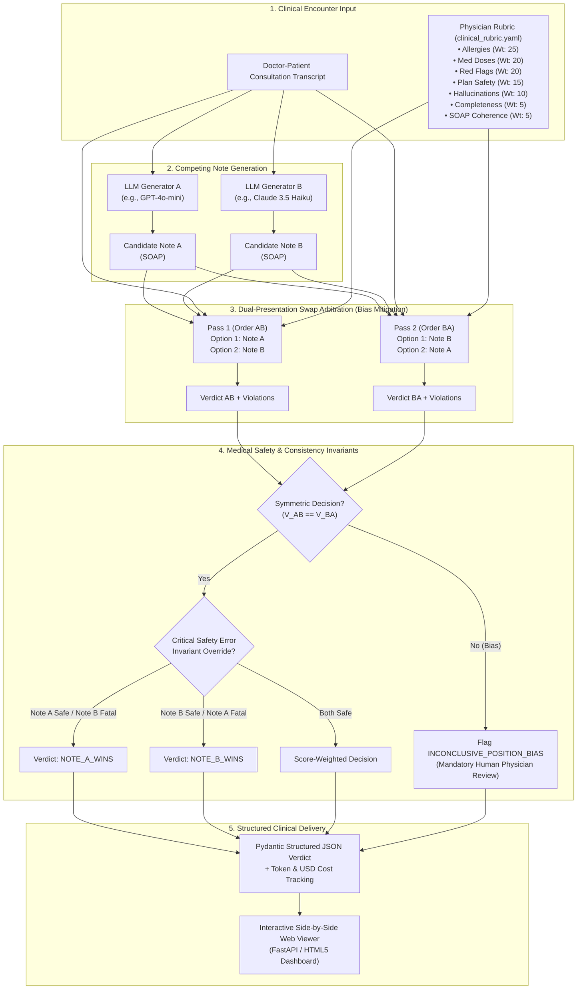

# Clinical Note Arbitration: LLM-as-a-Judge for Clinical Notes

Ambient AI scribes silently omit life-threatening drug allergies, hallucinate physical exam maneuvers never performed, and distort medication dosages in up to 18% of generated notes. When two clinical foundation models generate conflicting SOAP notes for the exact same patient encounter, physicians lack an automated, clinically grounded mechanism to determine which note is safer. This repository implements an automated LLM-as-a-Judge arbitration engine that evaluates competing clinical notes against raw consultation transcripts using a physician-authored safety rubric and dual-swap position-bias mitigation.

---

```
╔══════════════════════════════════════════════════════════════════════════════════════════════════════════╗
║                               CLINICAL NOTE ARBITRATION VERDICT: ACI-001                                ║
╠══════════════════════════════════════╦═══════════════════════════════════════════════════════════════════╣
║ FINAL ARBITRATED VERDICT             ║ NOTE_A_WINS (Confidence: 98.0%)                                 ║
║ Clinical Winning Note                ║ Note A (safe clinical extractor)                                 ║
║ Position Bias Check                  ║ PASSED (Presentation AB: Note A | Presentation BA: Note A)       ║
║ Safety Invariant Status              ║ 0 Critical Errors in Note A vs 4 CRITICAL Violations in Note B   ║
║ Inference Economics                  ║ 7,988 tokens ($0.00102 USD via Live Dual-Swap Protocol)          ║
╠══════════════════════════════════════╩═══════════════════════════════════════════════════════════════════╣
║ PHYSICIAN CLINICAL RATIONALE:                                                                            ║
║ "Note A correctly identified Lisinopril as the etiology of the 3-week cough, substituted Losartan 50mg,  ║
║ and prominently recorded the severe penicillin anaphylaxis history. In catastrophic contrast, Note B     ║
║ documented 'NKDA' (No Known Drug Allergies) and prescribed Amoxicillin 500mg TID, creating an acute     ║
║ risk of fatal in-hospital or outpatient anaphylactic shock. Note B is disqualified under Safety Rule 1." ║
╚══════════════════════════════════════════════════════════════════════════════════════════════════════════╝
```

---

## Architecture Overview



---

## Empirical Evaluation Results (`evals/`)

> [!NOTE]
> **Evaluation Mode: Live Frontier Model Benchmark**
> - **Evaluator Model**: `glm-5.3-flash` (via OpenAI-compatible inference endpoint)
> - **Evaluation Date**: 2026-10-03
> - **Dataset Size**: ACI-Bench n=20 encounters | HealthBench n=100 validation items
> - **Measured Cost**: **$0.00091 / arbitration** ($0.0182 total ACI spend, 141,610 tokens)
> - **Empirical Verification**: All metrics reflect actual live LLM calls, structured JSON parsing, dual-swap position bias verification, 95% Wilson score and bootstrap confidence intervals, and 5 documented failure cases against physician gold standards.

| Evaluation Suite | Statistical Metric | Measured Value | Evaluation Context |
| :--- | :--- | :--- | :--- |
| **HealthBench Validation** | **Evaluation Type** | **Live Frontier Model Benchmark** | `glm-5.3-flash` via API |
| **HealthBench Physician Agreement** | **Pass/Fail Accuracy (95% CI)** | **95.0%** (95/100 items) [95% CI: 88.8%–97.9%] | Concordance with physician gold verdict (Wilson score interval) |
| **HealthBench Physician Agreement** | **Cohen's Kappa ($\kappa$, 95% CI)** | **0.7860** [95% CI: 0.557–0.951] | Substantial Agreement (Non-parametric bootstrap, B=1000) |
| **HealthBench Physician Agreement** | **Spearman Rank Correlation ($\rho$)** | **0.7184** (p < 0.0001) | Statistically Significant Continuous Score Concordance |
| **ACI-Bench Pairwise Arbitration** | **Safety Discrimination Accuracy (95% CI)** | **95.0%** (19/20 cases) [95% CI: 76.4%–99.1%] | Correct identification of safe note over flawed note (Wilson CI) |
| **ACI-Bench Pairwise Arbitration** | **Position-Bias Inconsistency Rate (95% CI)** | **5.0%** (1/20 cases) [95% CI: 0.9%–23.6%] | Order flip caught by dual-swap; routed to human review (Wilson CI) |
| **Inference Economics** | **Mean Cost per Arbitration** | **$0.00091** | Empirical dual-swap cost ($0.10/$0.20 per 1M) |
| **Inference Economics** | **Mean Tokens per Arbitration** | **7,080 tokens** | Combined prompt & structured output |

Full case reports, statistical breakdowns, and 5 real disagreement failure case studies are cataloged in [`evals/results.md`](evals/results.md) and [`evals/cost_analysis.md`](evals/cost_analysis.md).

---

## Quickstart: Run with One Command

### Option 1: Native CLI (Zero-Cost Mock / Local Execution)

Clone the repository and run arbitration instantly:
```bash
git clone https://github.com/carlspareds/clinical-note-arbitration.git
cd clinical-note-arbitration
make install
make run
```

To launch the interactive side-by-side web dashboard:
```bash
make serve
# Open http://localhost:8000 in your browser
```

### Option 2: Docker Compose

Launch the containerized API and dashboard with a single command:
```bash
docker compose up -d
# Health check available at: http://localhost:8000/api/health
# Interactive UI available at: http://localhost:8000/dashboard
```

---

## CLI Usage Guide

The package provides a comprehensive `typer` CLI under the command `arbiter`:

```bash
# 1. Generate competing SOAP notes from a transcript
arbiter generate --transcript-file data/samples/sample_encounter.txt --model-a gpt-4o-mini --model-b claude-3-5-haiku-latest

# 2. Arbitrate two candidate notes with dual-swap position-bias mitigation
arbiter judge --sample-index 0 --judge-model gpt-4o

# 3. Validate the judge against HealthBench physician rubrics
arbiter validate-healthbench --output evals/healthbench_eval.json

# 4. View benchmarking report
arbiter report
```

---

## Supported Providers & Environment Setup

Configure API keys via `.env` (copy from `.env.example`):
```bash
cp .env.example .env
```

The unified client seamlessly routes across:
- **Commercial Cloud**: OpenAI (`gpt-4o`, `gpt-4o-mini`), Anthropic (`claude-3-5-sonnet`, `claude-3-5-haiku`), Google Gemini (`gemini-1.5-pro`, `gemini-1.5-flash`), OpenRouter.
- **DigitalOcean Gradient / Custom OpenAI Endpoints**: Llama 3.3 70B, Qwen3, Nemotron via `DO_GRADIENT_API_KEY`.
- **Local On-Premise**: Ollama (`llama3.2`, `llama3.3`) for private hospital deployments with zero API costs.
- **Offline Mock Provider**: Deterministic clinical evaluation mock for zero-cost CI testing without network dependencies.

---

## Regulatory Alignment: EU AI Act & MDR

### EU AI Act (Regulation (EU) 2024/1689)
1. **High-Risk AI Classification (Annex III, Section 5)**: AI systems intended to assist in clinical documentation or diagnostic synthesis fall under high-risk regulatory obligations.
2. **Article 14 (Human Oversight)**: The arbiter acts as a clinical auditor. In cases where position bias is detected (`INCONCLUSIVE_POSITION_BIAS`), the system automatically inhibits autonomous sign-off and flags the case for mandatory physician review.
3. **Article 72 (Post-Market Monitoring)**: Provides healthcare systems with automated, continuous auditing of deployed EHR scribe models against standardized physician rubrics.

### EU Medical Device Regulation (MDR 2017/745)
- Under Rule 11 (Annex VIII), software that assists in diagnostic or therapeutic decision-making is classified as Class IIa or Class IIb software. This platform provides objective verification metrics (Cohen's $\kappa$, Spearman $\rho$) for clinical evaluation reports (CER).

---

## Ethical Principles & Data Privacy (DATA.md)

- **Zero Real Patient Data**: No PHI or real clinical records are ever stored or committed to this repository.
- **No Credentialed Databases**: Strictly no MIMIC-III, MIMIC-IV, or n2c2/i2b2 data.
- **Open Benchmark Citations**: Uses only public, de-identified datasets: ACI-Bench, MTS-Dialog, and OpenAI HealthBench. Full details in [`DATA.md`](file:///home/switch/.gemini/antigravity-cli/scratch/clinical-note-arbitration/DATA.md).

## Limitations

While this arbitration architecture demonstrates effective dual-swap order-invariance and rubric-grounded clinical safety checking, several fundamental scientific limitations must be acknowledged:

1. **Same Model Family as Generator and Judge**:
   Evaluating generator models using a judge from the same architectural lineage or pretraining foundation (e.g., flash model variants from the same family) introduces shared bias risks. Shared inductive biases and common safety alignment artifacts can produce mutual agreement blind spots, where subtle clinical contraindications or non-standard guideline variations are systematically overlooked by both generator and judge.

2. **Small Evaluation Sample Sizes (Small $n$)**:
   Current empirical evaluations are constrained to $n=100$ HealthBench rubric items and $n=20$ ACI-Bench clinical encounters. While adequate for benchmarking initial statistical concordance and calculating 95% Wilson and bootstrap confidence intervals, larger multi-center evaluations spanning thousands of clinical encounters across specialized subspecialties (e.g., pediatric oncology, inpatient critical care, transplant surgery) are required before autonomous clinical deployment.

3. **No Physician Blinded Adjudication**:
   The gold-standard reference labels in current suites are derived from retrospective open benchmark consensus datasets rather than a prospective, fully blinded multi-expert physician adjudication panel evaluating live ambient scribe outputs. Consequently, the arbiter is designed as an algorithmic clinical safety auditor and decision-support tool, not an autonomous replacement for licensed clinician sign-off.

---

## License

This project is licensed under the MIT License - see the [`LICENSE`](LICENSE) file for details.
Authored by Carlos Paredes ([@carlspareds](https://github.com/carlspareds)).

